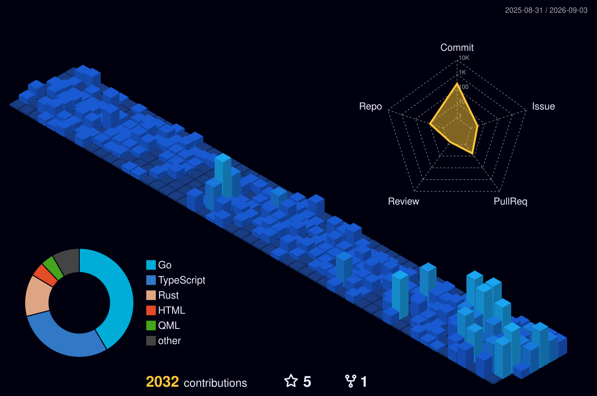

<picture>
  <source media="(prefers-color-scheme: dark)" srcset="assets/banner-hud-dark.svg">
  
</picture>

Twenty years of building software. Enterprise systems and cloud architecture pay
the bills. Rust, Go and Linux tooling are where the evenings go. Firmware when a
project calls for it, because it is worth knowing what happens all the way down.

Most of my work lives in private repos and org projects. What is public here is
side projects and the occasional experiment that outgrew a weekend.

Saint Johns, FL &nbsp;·&nbsp; [codenerd.llc](https://codenerd.llc) &nbsp;·&nbsp; [@copelandsoftware](https://github.com/copelandsoftware)

---

## Focus

|  |  |
| :-- | :-- |
| **Day** | Azure, .NET, distributed systems, REST API design |
| **Night** | Rust, Go, TypeScript, Linux and Hyprland tooling |
| **Further down** | ESP32 and ESP8266, firmware, hardware |

---

## Activity

<picture>
  <source media="(prefers-color-scheme: dark)" srcset="assets/stats-dark.svg">
  
</picture>
<picture>
  <source media="(prefers-color-scheme: dark)" srcset="assets/langs-dark.svg">
  
</picture>

---

## Selected work

|  |  |
| :-- | :-- |
| [**ccline**](https://github.com/eng1n88r/ccline) | Single-binary Rust statusline for Claude Code. |
| [**adaptive-charge**](https://github.com/eng1n88r/adaptive-charge) | Learns when you unplug, sets the battery charge ceiling to match. |
| [**overload**](https://github.com/eng1n88r/overload) | Self-hosted workout builder, tracker and training analytics. |
| [**terminal-stash**](https://github.com/eng1n88r/terminal-stash) | Shared clipboard and file drop for moving things between machines. |
| [**lg-companion-app-omarchy**](https://github.com/eng1n88r/lg-companion-app-omarchy) | Makes an LG webOS TV behave like a monitor on Linux. |
| [**home-brewery-temp-control**](https://github.com/eng1n88r/home-brewery-temp-control) | ESP8266 fermentation temperature control. |

Also worth a look: [Battle Snakes](https://battle-snakes.com).

---

Happy to talk systems design, scalability, or anything embedded.
