---

### CONTRIBUTION GRID

---

### SELECTED WORK

|  |  |
| :-- | :-- |
| [**ccline**](https://github.com/eng1n88r/ccline) | Single-binary Rust statusline for Claude Code. |
| [**adaptive-charge**](https://github.com/eng1n88r/adaptive-charge) | Learns when you unplug, sets the battery charge ceiling to match. |
| [**overload**](https://github.com/eng1n88r/overload) | Self-hosted workout builder, tracker and training analytics. |
| [**terminal-stash**](https://github.com/eng1n88r/terminal-stash) | Shared clipboard and file drop for moving things between machines. |
| [**lg-companion-app-omarchy**](https://github.com/eng1n88r/lg-companion-app-omarchy) | Makes an LG webOS TV behave like a monitor on Linux. |
| [**home-brewery-temp-control**](https://github.com/eng1n88r/home-brewery-temp-control) | ESP8266 fermentation temperature control. |

Most of my work lives in private repos and org projects. What is public here is
side projects and the occasional experiment that outgrew a weekend.

---

Saint Johns, FL &nbsp;·&nbsp; [codenerd.llc](https://codenerd.llc) &nbsp;·&nbsp; [@copelandsoftware](https://github.com/copelandsoftware) &nbsp;·&nbsp; [Battle Snakes](https://battle-snakes.com)

