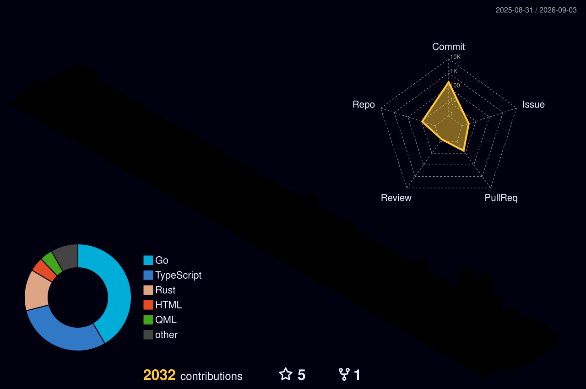

---

### CONTRIBUTION GRID

---

Most of my work lives in private repos and org projects. What is public here is
side projects and the occasional experiment that outgrew a weekend.

---

Saint Johns, FL &nbsp;·&nbsp; [codenerd.llc](https://codenerd.llc) &nbsp;·&nbsp; [@copelandsoftware](https://github.com/copelandsoftware) &nbsp;·&nbsp; [Battle Snakes](https://battle-snakes.com)

